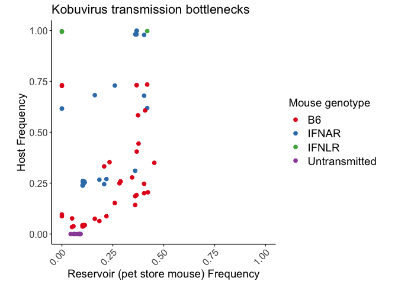
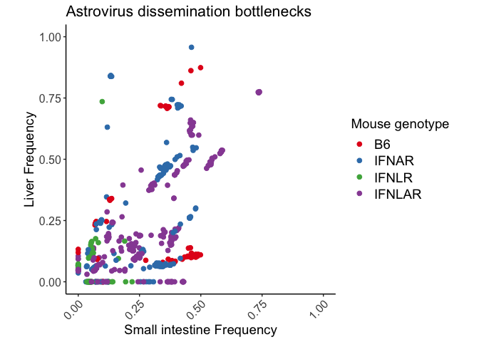
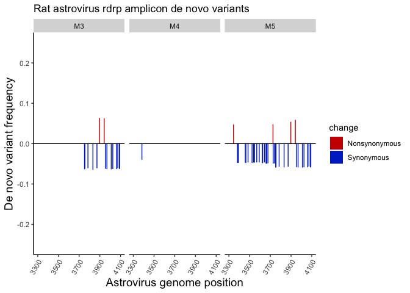

Dirty mouse virome-code for manuscript plots
================
Frances Shepherd
1/27/2021

### Astrovirus transmission analysis

``` r
library(ggplot2)
library(RColorBrewer)
library(dplyr)
library(stringr)

#Import data
dat <- read.csv("../final_data/astro_transmission_data.csv", header=TRUE, stringsAsFactors = FALSE) %>% #<- user set filename
  mutate(mouse_genotype = as.factor(mouse_genotype)) %>%
  subset(., PASS_repA == "TRUE" & PASS_repB == "TRUE" & exclude_from_final != "Y") %>% #Filter out observations with non-significant Fisher's exact tests, and those that fall within primer binding sites/outside of assembled consensus region.
  .[!grepl("[-\\+]", .$ALT), ] %>% #remove insertions or deletions from consideration
  .[,c("experiment", "primer_set", "mouse_ivar_number", "cage", "mouse_genotype", "REGION", "POS", "REF", "ALT", "REF_CODON", "REF_AA", "ALT_CODON", "ALT_AA", "average_variant_freq")] #pare down dataset


#separate the data into two separate dataframes, one containing the intra-petstore mouse variants, and one containing the SPF vs pet store mouse variants
petstore.variants <- dat[grep("petstore", dat$mouse_genotype), ]
spf.variants <- dat[-grep("petstore", dat$mouse_genotype), ]

merged<- merge(x=spf.variants, y=petstore.variants, by = c("experiment", "primer_set", "POS", "REF", "ALT", "cage", "REGION"), all.x = TRUE, all.y = TRUE, suffixes = c("_spf", "_petstore"))

#Replace NA's in the variant frequency columns with zeros so that the frequencies of variants can be graphed
merged[,c("average_variant_freq_spf", "average_variant_freq_petstore")][is.na(merged[,c("average_variant_freq_spf", "average_variant_freq_petstore")])] <- 0

#Make the mouse genotypes into character type
merged$mouse_genotype_spf <- as.character(merged$mouse_genotype_spf)

#Replace NA's in the "Reference_spf" column to "untransmitted" to allow for graphing
merged[,"mouse_genotype_spf"][is.na(merged[,"mouse_genotype_spf"])] <- "untransmitted"

#Turn mouse genotypes back to factor type
merged$mouse_genotype_spf <- as.factor(merged$mouse_genotype_spf)

#Rename mouse genotypes for the graph legend
levels(merged$mouse_genotype_spf) <- list("B6"="b6_cohoused",
                                         "IFNAR" = "IFNAR_ko_cohoused",
                                         "IFNLR" = "IFNLR_ko_cohoused",
                                         "IFNLAR" = "IFNLAR_ko_cohoused",
                                         "Untransmitted" = "untransmitted")

###Plot of bottleneck analysis
ggplot(merged, aes(y=average_variant_freq_spf, x=average_variant_freq_petstore))+
  geom_point(aes(color = mouse_genotype_spf),
             size = 2)+
  scale_color_brewer(palette = "Set1")+
  labs(color = "Mouse genotype")+
  scale_x_continuous(limits = c(0, 1), name="Reservoir (pet store mouse) Frequency") +
  scale_y_continuous(limits = c(0, 1), name="Host Frequency") +
  ggtitle("Astrovirus transmission bottlenecks")+
  theme(panel.grid = element_blank(),
        panel.background = element_blank(),
        axis.line = element_line(colour = "black"),
        legend.key = element_blank(),
        plot.title = element_text(size = 16),
        axis.title = element_text(size = 14),
        axis.text.y = element_text(size = 12),
        axis.text.x = element_text(size = 12, angle = 45, hjust = 1),
        legend.title = element_text(size = 14),
        legend.text = element_text(size = 14),
        strip.text = element_text(size = 16),
        aspect.ratio = 1)
```


### Kobuvirus transmission bottlenecks

``` r
#Read in data
dat <- read.csv("../final_data/kobu_transmission_data.csv", header=TRUE, stringsAsFactors = FALSE) %>% #<- user set filename
  mutate(mouse_genotype = as.factor(mouse_genotype)) %>%
  subset(., PASS_repA == "TRUE" & PASS_repB == "TRUE" & exclude_from_final != "Y") %>% #Filter out observations with non-significant Fisher's exact tests, and those that fall within primer binding sites/outside of assembled consensus region.
  .[!grepl("[-\\+]", .$ALT), ] %>% #remove insertions or deletions from consideration
  .[,c("experiment", "primer_set", "mouse_ivar_number", "cage", "mouse_genotype", "REGION", "POS", "REF", "ALT", "REF_CODON", "REF_AA", "ALT_CODON", "ALT_AA", "average_variant_freq")] #pare down dataset


#separate the data into two separate dataframes, one containing the intra-petstore mouse variants, and one containing the SPF vs pet store mouse variants
petstore.variants <- dat[grep("petstore", dat$mouse_genotype), ]
spf.variants <- dat[-grep("petstore", dat$mouse_genotype), ]

merged<- merge(x=spf.variants, y=petstore.variants, by = c("experiment", "primer_set", "POS", "REF", "ALT", "cage", "REGION"), all.x = TRUE, all.y = TRUE, suffixes = c("_spf", "_petstore"))

#Replace NA's in the variant frequency columns with zeros so that the frequencies of variants can be graphed
merged[,c("average_variant_freq_spf", "average_variant_freq_petstore")][is.na(merged[,c("average_variant_freq_spf", "average_variant_freq_petstore")])] <- 0

#Make the mouse genotypes into character type
merged$mouse_genotype_spf <- as.character(merged$mouse_genotype_spf)

#Replace NA's in the "Reference_spf" column to "untransmitted" to allow for graphing
merged[,"mouse_genotype_spf"][is.na(merged[,"mouse_genotype_spf"])] <- "untransmitted"

#Turn mouse genotypes back to factor type
merged$mouse_genotype_spf <- as.factor(merged$mouse_genotype_spf)

#Rename mouse genotypes for the graph legend
levels(merged$mouse_genotype_spf) <- list("B6"="b6_cohoused",
                                         "IFNAR" = "IFNAR_ko_cohoused",
                                         "IFNLR" = "IFNLR_ko_cohoused",
                                         "IFNLAR" = "IFNLAR_ko_cohoused",
                                         "Untransmitted" = "untransmitted")

###Plot of bottleneck analysis
ggplot(merged, aes(y=average_variant_freq_spf, x=average_variant_freq_petstore))+
  geom_point(aes(color = mouse_genotype_spf),
             size = 2)+
  scale_color_brewer(palette = "Set1")+
  labs(color = "Mouse genotype")+
  scale_x_continuous(limits = c(0, 1), name="Reservoir (pet store mouse) Frequency") +
  scale_y_continuous(limits = c(0, 1), name="Host Frequency") +
  ggtitle("Kobuvirus transmission bottlenecks")+
  theme(panel.grid = element_blank(),
        panel.background = element_blank(),
        axis.line = element_line(colour = "black"),
        legend.key = element_blank(),
        plot.title = element_text(size = 16),
        axis.title = element_text(size = 14),
        axis.text.y = element_text(size = 12),
        axis.text.x = element_text(size = 12, angle = 45, hjust = 1),
        legend.title = element_text(size = 14),
        legend.text = element_text(size = 14),
        strip.text = element_text(size = 16),
        aspect.ratio = 1)
```



### Astrovirus dissemination bottlenecks

``` r
#Read in data
dat <- read.csv("../final_data/astro_dissemination_data.csv", header = T, stringsAsFactors = FALSE) %>%
  mutate(mouse_genotype = as.factor(mouse_genotype)) %>%
  subset(., PASS_repA == "TRUE" & PASS_repB == "TRUE" & exclude_from_final != "Y") %>% #Filter out observations with non-significant Fisher's exact tests, and those that fall within primer binding sites/outside of assembled consensus region.
  filter(!str_detect(ALT, "-")) %>% #remove insertions or deletions from consideration
  filter(!str_detect(ALT, "\\+")) %>%
  .[,c("experiment", "primer_set", "mouse_ivar_number", "cage", "mouse_genotype", "REGION", "POS", "REF", "ALT", "REF_CODON", "REF_AA", "ALT_CODON", "ALT_AA", "average_variant_freq")] #pare down dataset


#separate the data into two separate dataframes, one containing the SI vs. SI read variants, and one containing the liver vs SI read variants
si.variants <- dat[grep("AK04_si", dat$experiment), ] %>%
  within(., rm(experiment, REF_CODON, REF_AA, ALT_CODON, ALT_AA))

liv.variants <- dat[grep("AK04_liv", dat$experiment), ] %>%
  within(., rm(experiment))

#Merge the two dataframes so that the frequencies can be compared between the liver and SI datasets
merged<- merge(x=liv.variants, y=si.variants, by = c("primer_set", "REGION", "POS", "REF", "ALT", "cage", "primer_set", "mouse_ivar_number", "mouse_genotype"), all.x = TRUE, all.y = TRUE, suffixes = c("_liv", "_si"))

#Replace NA's in the variant frequency columns with zeros so that the frequencies of variants can be graphed
merged[,c("average_variant_freq_liv", "average_variant_freq_si")][is.na(merged[,c("average_variant_freq_liv", "average_variant_freq_si")])] <- 0


#Turn mouse genotypes and cage #'s to factor type
merged <- merged %>%
  mutate(mouse_genotype = factor(mouse_genotype)) %>%
  droplevels()

#Rename mouse genotypes
levels(merged$mouse_genotype) <- list("B6"="b6_cohoused",
                                         "IFNAR" = "IFNAR_ko_cohoused",
                                         "IFNLR" = "IFNLR_ko_cohoused",
                                         "IFNLAR" = "IFNLAR_ko_cohoused")
#Plot dissemination graph
ggplot(merged, aes(y=average_variant_freq_liv, x=average_variant_freq_si))+
  geom_point(aes(color = mouse_genotype),
             size = 2)+
#  scale_color_manual(values=c("#E41A1C", "#377EB8", "#FF7F00")) +
  scale_color_brewer(palette = "Set1")+
  labs(shape = "Cage", color = "Mouse genotype")+
  scale_x_continuous(limits = c(0, 1), name="Small intestine Frequency") +
  scale_y_continuous(limits = c(0, 1), name="Liver Frequency") +
  ggtitle("Astrovirus dissemination bottlenecks")+
  theme(panel.grid = element_blank(),
        panel.background = element_blank(),
        #strip.background = element_rect(color = "black", size=0.5, fill = "white"),
        axis.line = element_line(colour = "black"),
        legend.key = element_blank(),
        plot.title = element_text(size = 16),
        axis.title = element_text(size = 14),
        axis.text.y = element_text(size = 12),
        axis.text.x = element_text(size = 12, angle = 45, hjust = 1),
        legend.title = element_text(size = 14),
        legend.text = element_text(size = 14),
        strip.text = element_text(size = 16),
        aspect.ratio = 1)
```



### Rat astrovirus de novo variants graph

``` r
#Read in data
dat <- read.csv("../final_data/combined_rat_variants.csv", header = T, stringsAsFactors = FALSE) %>%
  subset(., PASS_repA == "TRUE" & PASS_repB == "TRUE" & exclude_from_final == "N") %>% #Filter out observations with non-significant Fisher's exact tests, and those that fall within primer binding sites/outside of assembled consensus region.
    .[,c("experiment", "primer_set", "mouse_ivar_number", "cage", "mouse_genotype", "REGION", "POS", "REF", "ALT", "REF_CODON", "REF_AA", "ALT_CODON", "ALT_AA", "average_variant_freq")]


#separate the capsid.data into three separate capsid.dataframes: 1. Variants found in rat 1; 2. Variants found in rat 2; 3. Variants found in b6 SPF mice
rat_1 <- dat %>%
  .[grep("rat_1", .$mouse_genotype), ] %>%
  .[,c("primer_set", "cage", "POS", "REF", "ALT", "average_variant_freq")] %>%
  dplyr::rename(rat_1_freq = average_variant_freq)


rat_2 <- dat %>%
  .[grep("rat_2", .$mouse_genotype), ] %>%
  .[,c("primer_set", "cage", "POS", "REF", "ALT", "average_variant_freq")] %>%
  dplyr::rename(rat_2_freq = average_variant_freq)


b6 <- dat %>%
  .[grep("B6", .$mouse_genotype), ] %>%
  dplyr::rename(b6_freq = average_variant_freq)


#Merge the 3 dataframes based on the variant position.
#Write merge function which can take 3 datasets as input
MyMerge <- function(x,y) {
  df <- merge(x, y, by = c("primer_set", "POS", "REF", "ALT", "cage"), all.x = TRUE, all.y=TRUE)
  return(df)
}

#Combine the 3 datasets based on primer set, variant position, nucleotide change and cage
combined.data <- Reduce(MyMerge, list(rat_1, rat_2, b6))

#Change any values that are NA to 0, since non-existent variants in pet store mice technically have a frequency of 0.
combined.data[,c("rat_1_freq", "rat_2_freq")][is.na(combined.data[,c("rat_1_freq", "rat_2_freq")])] <- 0

#Create a new dataframe that only contains the de novo variants by grabbing only the b6 variants that were NOT identified in either pet store rat
denovo.variants <- combined.data %>%
  subset(.,rat_1_freq == 0 & rat_2_freq == 0) %>%
  mutate(change = ifelse(REF_AA == ALT_AA, "S", "N")) %>%
  mutate(change = as.factor(change)) %>%
  mutate(b6_freq = ifelse(change == "N", b6_freq, -b6_freq))

ggplot(data = denovo.variants, aes(x=POS, y = b6_freq, fill = change, color = change)) +
  geom_bar(width = 0.1, stat = "identity", position = "dodge") +
  geom_hline(yintercept = 0)+
  facet_grid(.~mouse_ivar_number) +
  scale_color_manual(values = c("#CC0000", "#0033CC"), guide="none")+
  scale_fill_manual(values = c("#CC0000", "#0033CC"), labels=c("Nonsynonymous", "Synonymous"))+
  scale_x_continuous(limits = c(3300, 4100), 
                     breaks = seq(3300, 4100, 200),
                     name="Astrovirus genome position") +
  scale_y_continuous(limits = c(-0.25,0.25), name="De novo variant frequency") +
  ggtitle("Rat astrovirus rdrp amplicon de novo variants") +
  theme(panel.grid = element_blank(),
        panel.background = element_blank(),
        axis.line = element_line(colour = "black"),
        legend.key = element_blank(),
        axis.title = element_text(size = 14),
        axis.text.x = element_text(angle = 60, hjust=1))
```


